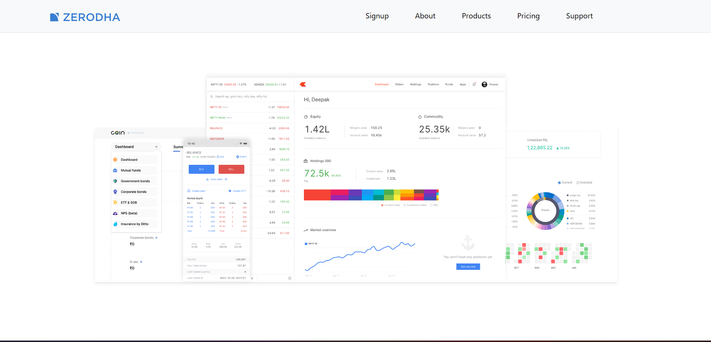
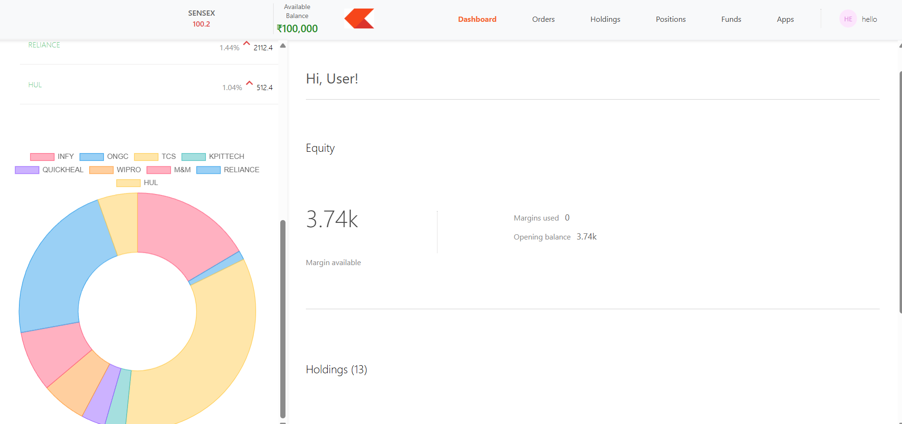
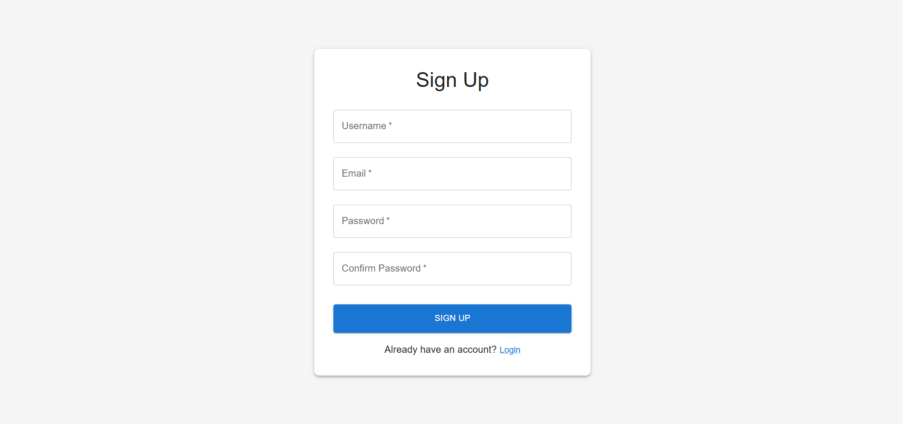
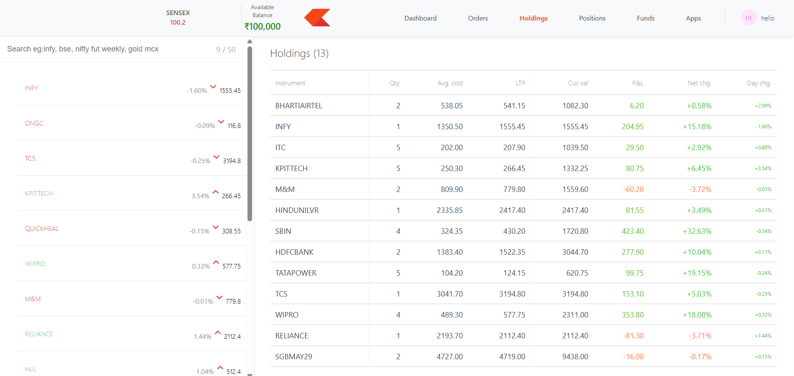
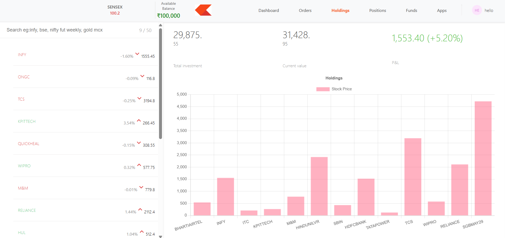

Zerodha Clone – Full Stack Trading Platform

📌 Description

A fully functional Zerodha-inspired trading platform clone built using modern web technologies.
This project replicates the core UI/UX and functionality of a stock trading platform with a clean design, responsive interface, and scalable backend.

📁 Project Structure
    Stock Trading Platform/   
        ┣ backend/ → REST API (Node.js, Express) 
        ┣ dashboard/ → Admin Panel
        ┣ frontend/ → User Interface (React) 

⚙️ Tech Stack
Frontend: React.js, Bootstrap(Framework)
Backend: Node.js, Express.js
Database: MongoDB, Mongoose
Authentication & Security: bcrypt
APIs & Middleware: CORS
Data Visualization: Chart.js
Deployment: Vercel, Render

✨ Features
🔐 User Authentication (Login / Signup)
📊 Interactive Trading Dashboard
📈 Stock-like UI Interface
🔗 REST API Integration
📱 Fully Responsive Design
⚡ Fast & Optimized Performance

📸 Screenshots

Landing Page

Dashboard

Sign Up 

Holdings

Charts

📌 Future Improvements
Real-time stock data integration
Payment gateway
Advanced analytics dashboard

👨‍💻 Author

Bhoomi Chawla

⭐ Support

If you like this project, give it a ⭐ on GitHub!